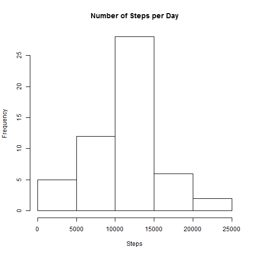
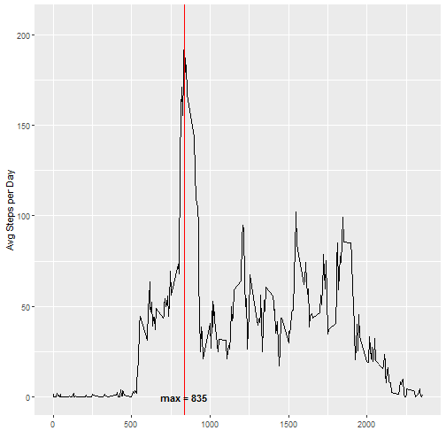
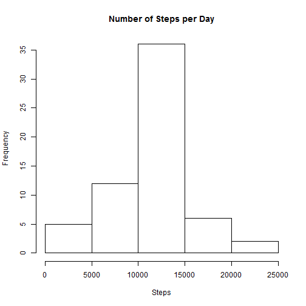
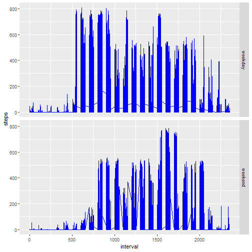

```r
title: "Reproducible Research: Peer Assessment 1"
```

```
## Warning: NAs introduced by coercion
```

```
## Error in title:"Reproducible Research: Peer Assessment 1": NA/NaN argument
```

```r
output: 
  html_document:
    keep_md: true
```

```
## Error in eval(expr, envir, enclos): object 'output' not found
```


## Loading data

The first step of the assignment consists in loading and preprocessing data from the CSV.


```r
activity <- unzip("activity.zip")
data <- read.csv('activity.csv', na.strings='NA')

dataComplete <- data[complete.cases(data), ]
```

## What is mean total number of steps taken per day?

Here is an histogram representing the total steps taken per day:


```r
stepsByDay <-aggregate(dataComplete$steps, by=list(dataComplete$date), FUN=sum, na.rm=TRUE)

names(stepsByDay)<- c("Date","Steps")

hist(stepsByDay$Steps,
     main="Number of Steps per Day",
     xlab="Steps")
```



This is the **mean** of the total number of steps taken per day:


```r
mean(stepsByDay$Steps)
```

```
## [1] 10766.19
```

This is the **median** of the total number of steps taken per day:


```r
median(stepsByDay$Steps)
```

```
## [1] 10765
```

## What is the average daily activity pattern?

Here is a time series plot made with ggplot2 of the 5-minute interval (x-axis) and the average number of steps taken, averaged across all days (y-axis)


```r
library(ggplot2, quietly = TRUE)

stepsByInterval <-aggregate(dataComplete$steps, 
                            by=list(dataComplete$interval), 
                            FUN=mean, na.rm=TRUE)

names(stepsByInterval) <- c("Interval","Steps")

ggplot(stepsByInterval, aes(Interval, Steps)) +
    geom_line() + xlab("") + ylab("Avg Steps per Day") +
    geom_vline(xintercept = 835, color = "red")+
    annotate(geom="text",x=835,
             y=0,label="max = 835",fontface="bold")
```



Extract the interval with the max number of steps:


```r
stepsByInterval[which.max(stepsByInterval$Steps),]
```

```
##     Interval    Steps
## 104      835 206.1698
```


## Imputing missing values

In the dataset there are some NAs, the exact number of rows with NAs is:


```r
dataIncomplete <- data[!complete.cases(data), ]
nrow(dataIncomplete)
```

```
## [1] 2304
```

We fill NAs with the mean of the steps for the relative interval. 
x will contain the original data without NAs.


```r
library(dplyr, quietly = TRUE)
x <- data
x <- x %>% group_by(interval) %>% 
    mutate(steps= 
       ifelse(is.na(steps), mean(steps, na.rm=TRUE), steps))
```

Here is the histogram of x representing the number of steps by day, it is very similar to the previous:

```r
xStepsByDay <-aggregate(x$steps, by=list(x$date), FUN=sum)
names(xStepsByDay)<- c("Date","Steps")
hist(xStepsByDay$Steps,
     main="Number of Steps per Day",
     xlab="Steps")
```



This is the **mean** of the total number of steps taken per day with NAs filled, it isn't changed:


```r
mean(xStepsByDay$Steps)
```

```
## [1] 10766.19
```

This is the **median** of the total number of steps taken per day with NAs filled, it is slightly different:


```r
median(xStepsByDay$Steps)
```

```
## [1] 10766.19
```

## Are there differences in activity patterns between weekdays and weekends?

Difference between weekdays and weekends:


```r
x$date <- as.Date(x$date, format="%Y-%m-%d")

x$day <- weekdays(x$date, abbr = TRUE)

x$isWe <- ifelse(x$day %in% c("sab", "dom"), "weekend",
                    "weekday")
x$isWe <- as.factor(x$isWe)

p1 <- ggplot(x, aes(x=interval, y=steps)) +
    geom_line(colour="blue") + 
    facet_grid(isWe ~ .)
print(p1)
```


```
```

